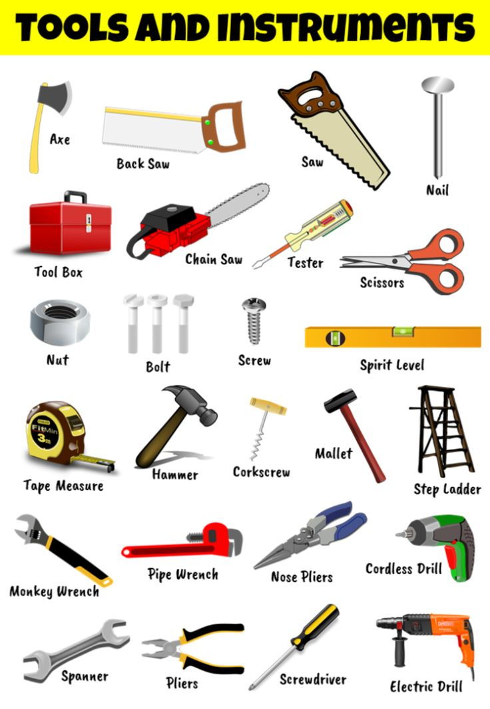
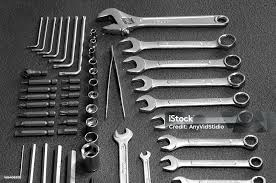
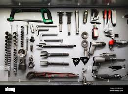

<html>
<head>
<h1 style="text-align:center;background-color:yellow;color:red;font-family:times;">Industrial Quotes</h1>
  

  
</head>
<!--<body style="background-color: rgb(141, 192, 219);text-align:center;">-->
  
<body style="background-color: rgb(141, 192, 219);text-align:center;">
<!-- How this works -->

What does a <strong> mechanical engineer </strong> do?
Mechanical engineers design machines that are used to create energy and promote efficiency, like generators and elevators. Here are some of the duties of mechanical engineers:.

 Mechanical engineers use a variety of handheld and digital tools to help them complete their tasks at work. Learning about the tools that mechanical engineers use can help you prepare for a career in engineering. In this article, we list the duties of mechanical engineers, provide tips for working as a mechanical engineer and describe mechanical engineer tools..

<!--<a href="https://www.w3schools.com" target="_blank">This is a <strong> link </strong> </a> -->

<body>

  <button class="dropbtn">Dropdown</button>
  

  <a href="https://forms.gle/7afBmqdXcmUjxLiJ7">Cutting tools</a>
  <a href="https://forms.gle/7afBmqdXcmUjxLiJ7">Electric tools </a>
  <a href="https://forms.gle/7afBmqdXcmUjxLiJ7">Clamps</a>
  

</body>

<ul>
  <li>Designing machines: Mechanical engineers can design machines on paper or with the help of computer software.</li>
  <li>Building: A mechanical engineer can also build machines they design or work as part of a team to build a large machine.</li>
  <li>T**esting:** Once a machine is built, a mechanical engineer can test it to make sure it works in a variety of environments and situations.</li>
</ul> 
<!--<link rel="icon" type="image/x-icon" href="image1.png">-->

<body style="text-align:center;background-color:yellow;color:yellow;font-family:times;">
<pre>

Mechanical engineer software tools
Mechanical engineers also use computer software to design and develop machinery. Here are some of the software tools a mechanical engineer might use:

1. Construction software
Construction software is a computer program that allows users to create plans for an object. A mechanical engineer can use construction software to collaborate with other engineers as they build a complex machine.

2. CAD software
Computer-aided design is a program that helps users design complex objects, like a car engine. Mechanical engineers frequently use CAD software to efficiently design new machines and parts.

Here are a few examples of CAD software:

SolidWorks: This popular program helps mechanical engineers in various industries design two- and three-dimensional objects.
CATIA: This software is more affordable than SolidWorks and offers several of the same capabilities.
Fusion 360: Fusion 360 allows mechanical engineers to collaborate with others on machine design.
3. CAM software
Computer-aided manufacturing is software that mechanical engineers can use to create objects that you design using CAD software. Here are some examples of CAM software:

SolidCAM: This manufacturing software plugs into SolidWorks, which can help streamline engineers' product creation workflows.
CATIA: This software also offers manufacturing capabilities to users.
4. 3D printing software
Mechanical engineers can use 3D printing software to design objects they want to create using a 3D printer. Fusion 360, Solid Edge, Tinkercad and OnShape are examples of 3D printing software that engineers might use on the job.

5. FEA software
Finite element analysis software can help engineers predict how a product will react to forces like heat, air flow, fluid flow, vibration and cold. Engineers can use this software to analyze the strength of their designs. Here are a few types of FEA software:

ANSYS: This company offers a few different programs that can assist mechanical engineers in testing and analyzing their designs.
Autodesk Inventor: The parent company of Fusion 360 also offers FEA capabilities in its software suite.
6. Microsoft Excel
Mechanical engineers can use this popular spreadsheet software to perform calculations and record data on machines and parts. Here are some ways that mechanical engineers can use Excel:

Unit conversions: Engineers often work with multiple units of measurement. Spreadsheets can help them quickly convert between units.
Chart creation: Engineers can use charts to visualize the data they collect and calculations they perform in Excel.
Table referencing: Excel allows mechanical engineers to reference one table in another table, allowing for more complicated data analysis to be presented and sourced easily.
Customized functions: Mechanical engineers often use the same functions and calculations repeatedly on the job. Excel can help automate these repetitive calculations.
7. Visual Basic for Applications (VBA)
Visual basic is a coding language that mechanical engineers can use to automate many of their digital tasks. Visual basic can be paired with Excel to automate calculations and other functions. Engineers can also pair VBA with CAD software to automate repetitive functions. VBA can increase mechanical engineers' efficiency and productivity.
</pre>
</body>

</body>
</html>
